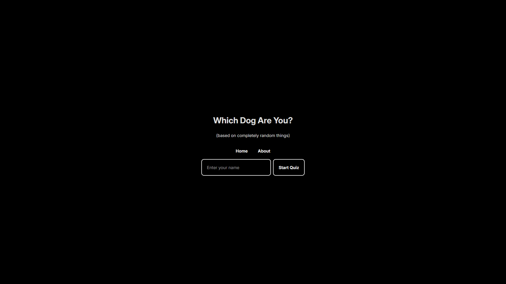

# Which Dog Are You?

> A quiz to find out which breed of dog you would be.
> 
> Site: [Which Dog Are You?](https://which-dog-are-you.vercel.app)

### Description

This is my final project to complete the FRAMEWORK VALLEY: REACT course.
I followed the instructions given for creating the page, but I also made my own customizations
to make it unique.